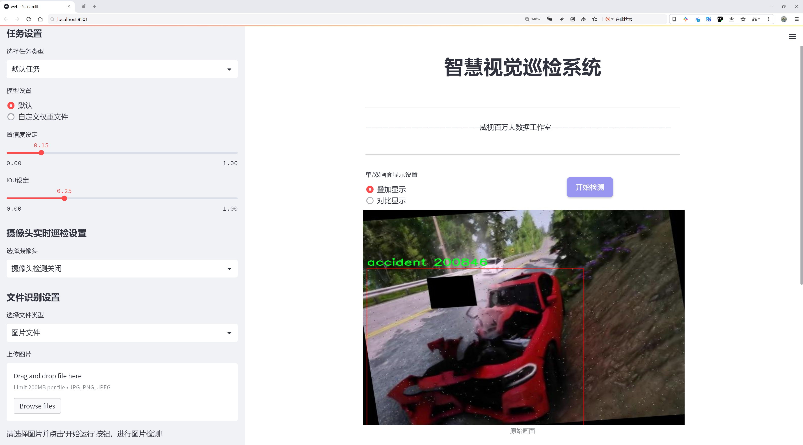
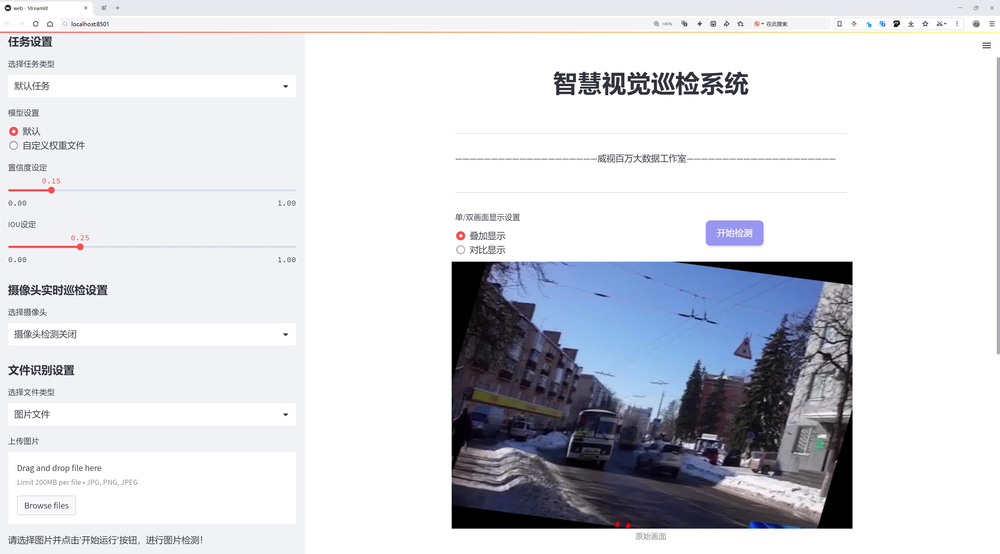
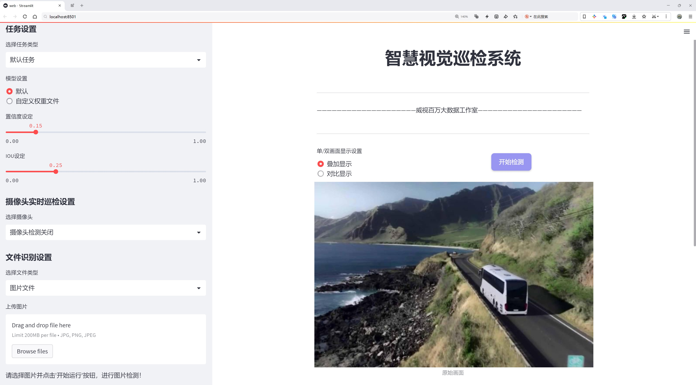
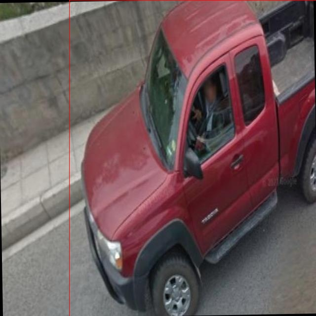
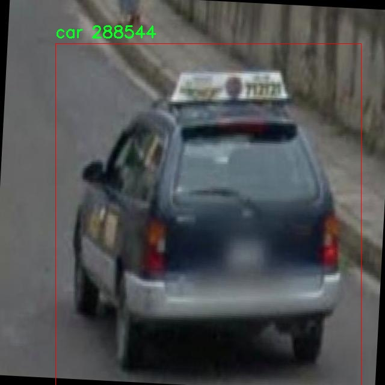
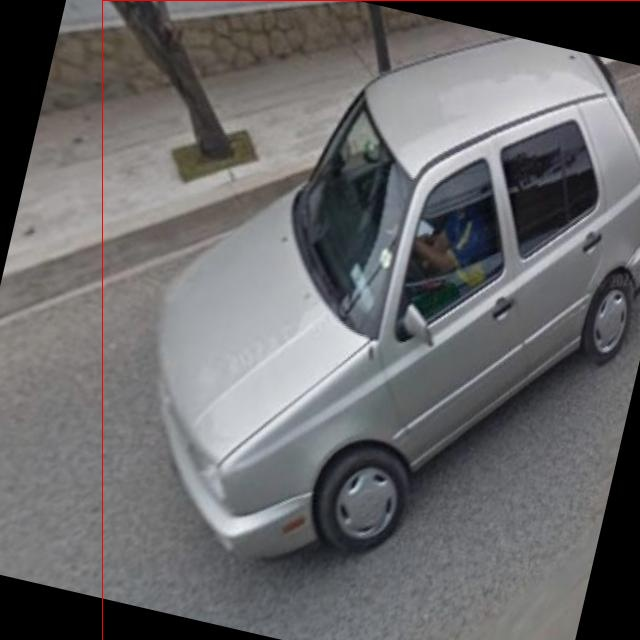
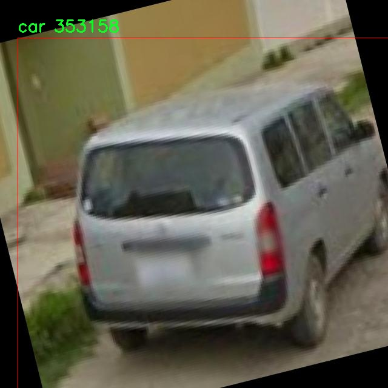
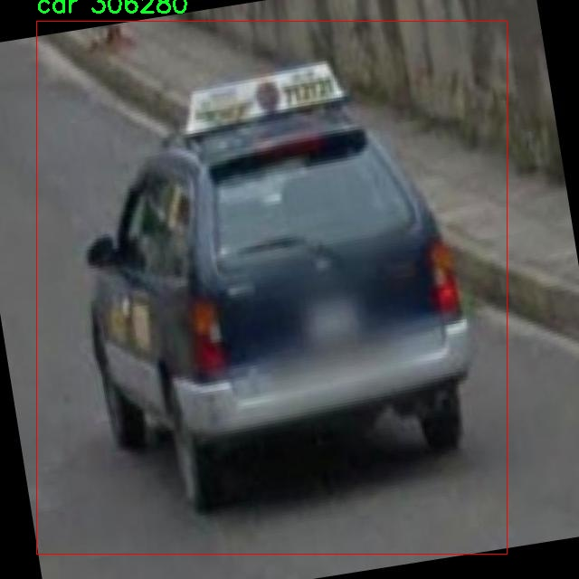

# 交通事故检测系统源码分享
 # [一条龙教学YOLOV8标注好的数据集一键训练_70+全套改进创新点发刊_Web前端展示]

### 1.研究背景与意义

项目参考[AAAI Association for the Advancement of Artificial Intelligence](https://gitee.com/qunmasj/projects)

项目来源[AACV Association for the Advancement of Computer Vision](https://kdocs.cn/l/cszuIiCKVNis)

研究背景与意义

随着城市化进程的加快，交通事故的发生频率逐年上升，给社会带来了巨大的经济损失和人身伤害。根据世界卫生组织的统计，交通事故已成为全球范围内导致死亡的重要原因之一。为了提高交通安全，减少事故发生的概率，交通事故检测系统的研究显得尤为重要。近年来，深度学习技术的迅猛发展为交通事故检测提供了新的解决方案，其中基于YOLO（You Only Look Once）系列的目标检测模型因其高效性和实时性而受到广泛关注。

YOLOv8作为YOLO系列的最新版本，具备了更强的特征提取能力和更快的检测速度，能够在复杂的交通环境中快速识别多种目标。然而，现有的YOLOv8模型在交通事故检测中的应用仍存在一些不足之处，如对小目标的检测精度不足、对复杂场景的适应性差等。因此，针对这些问题进行改进，构建一个基于改进YOLOv8的交通事故检测系统，具有重要的理论和实践意义。

本研究将使用一个包含3000张图像的数据集，该数据集涵盖了五个类别：事故、公交车、汽车、坑洼和卡车。这些类别的选择不仅反映了交通环境的复杂性，也为模型的训练提供了丰富的样本。通过对事故场景的准确识别，能够有效地为交通管理部门提供实时数据支持，帮助其制定更为科学的交通管理策略。此外，事故检测系统的实现将为自动驾驶技术的发展提供重要的基础，推动智能交通系统的建设。

在数据集的构建过程中，样本的多样性和代表性是关键因素。通过对不同交通场景的采集和标注，可以确保模型在训练过程中获得充分的特征学习，从而提高其在实际应用中的泛化能力。特别是在复杂天气条件、不同光照环境和多种交通工具并存的情况下，改进后的YOLOv8模型将能够更好地适应各种变化，提升交通事故检测的准确性和可靠性。

此外，交通事故检测系统的研究还具有重要的社会意义。通过提高交通安全水平，可以有效减少交通事故带来的伤亡和财产损失，提升公众的出行安全感。同时，该系统的推广应用将促进智能交通技术的发展，推动城市交通管理的智能化、信息化进程，为实现可持续交通发展目标奠定基础。

综上所述，基于改进YOLOv8的交通事故检测系统的研究，不仅具有重要的学术价值，也为实际交通管理提供了有效的技术支持。通过深入探索和优化目标检测模型，能够为构建更加安全、高效的交通环境贡献力量，推动社会的可持续发展。

### 2.图片演示







##### 注意：由于此博客编辑较早，上面“2.图片演示”和“3.视频演示”展示的系统图片或者视频可能为老版本，新版本在老版本的基础上升级如下：（实际效果以升级的新版本为准）

  （1）适配了YOLOV8的“目标检测”模型和“实例分割”模型，通过加载相应的权重（.pt）文件即可自适应加载模型。

  （2）支持“图片识别”、“视频识别”、“摄像头实时识别”三种识别模式。

  （3）支持“图片识别”、“视频识别”、“摄像头实时识别”三种识别结果保存导出，解决手动导出（容易卡顿出现爆内存）存在的问题，识别完自动保存结果并导出到tempDir中。

  （4）支持Web前端系统中的标题、背景图等自定义修改，后面提供修改教程。

  另外本项目提供训练的数据集和训练教程,暂不提供权重文件（best.pt）,需要您按照教程进行训练后实现图片演示和Web前端界面演示的效果。

### 3.视频演示

[3.1 视频演示](https://www.bilibili.com/video/BV12w23YPE6Y/)

### 4.数据集信息展示

##### 4.1 本项目数据集详细数据（类别数＆类别名）

nc: 5
names: ['accident', 'bus', 'car', 'pothole', 'truck']


##### 4.2 本项目数据集信息介绍

数据集信息展示

在现代交通管理与安全监控领域，交通事故的实时检测与响应显得尤为重要。为此，我们构建了一个名为“Complex”的数据集，旨在为改进YOLOv8的交通事故检测系统提供丰富的训练素材。该数据集包含五个主要类别，分别是“accident”（事故）、“bus”（公交车）、“car”（小汽车）、“pothole”（坑洼）和“truck”（卡车）。这些类别的选择不仅涵盖了交通事故中常见的参与者和环境因素，还为模型的多样性和准确性提供了必要的基础。

“Complex”数据集的设计理念是模拟真实世界中的复杂交通场景。事故的发生往往与多种因素交织在一起，例如不同类型的车辆、道路状况以及环境因素。因此，数据集中包含的五个类别相互关联，形成了一个多维度的交通环境。这种设计使得YOLOv8能够在训练过程中学习到更为复杂的特征，从而提高其在实际应用中的表现。

在数据集的构建过程中，我们特别注重数据的多样性和代表性。事故类别的样本包括各种类型的交通事故场景，例如两车相撞、车辆与行人发生碰撞等，确保模型能够识别不同形式的事故。同时，公交车、小汽车和卡车等车辆类别的样本也涵盖了不同品牌、颜色和尺寸，以便模型能够适应多样化的交通情况。此外，坑洼作为道路状况的一个重要因素，能够帮助模型识别潜在的安全隐患，从而在事故发生前提供预警。

为了增强数据集的实用性，我们还在不同的天气条件和时间段内收集了样本。这意味着“Complex”数据集不仅包括晴天的交通场景，还涵盖了雨天、雾天等低能见度条件下的情况。这种多样化的环境设置将使得YOLOv8在实际应用中具备更强的适应能力，能够在各种复杂条件下进行准确的事故检测。

在数据标注方面，我们采用了高标准的标注流程，确保每个类别的样本都经过精确的标注，以便于模型在训练时能够获得准确的信息。标注过程中，专业团队对每一帧图像进行了仔细审查，确保事故、车辆及道路状况等关键元素都被准确标识。这种严谨的标注过程为模型的训练提供了坚实的基础，使得YOLOv8能够有效地学习到每个类别的特征。

总之，“Complex”数据集的构建不仅考虑了交通事故检测的实际需求，还注重了数据的多样性和标注的准确性。通过这一数据集，我们期望能够显著提升YOLOv8在交通事故检测领域的性能，为交通安全管理提供更为有效的技术支持。随着交通流量的不断增加，提升事故检测系统的智能化水平将对减少交通事故、保障公众安全产生深远的影响。











### 5.全套项目环境部署视频教程（零基础手把手教学）

[5.1 环境部署教程链接（零基础手把手教学）](https://www.ixigua.com/7404473917358506534?logTag=c807d0cbc21c0ef59de5)


[5.2 安装Python虚拟环境创建和依赖库安装视频教程链接（零基础手把手教学）](https://www.ixigua.com/7404474678003106304?logTag=1f1041108cd1f708b01a)

### 6.手把手YOLOV8训练视频教程（零基础小白有手就能学会）

[6.1 手把手YOLOV8训练视频教程（零基础小白有手就能学会）](https://www.ixigua.com/7404477157818401292?logTag=d31a2dfd1983c9668658)


按照上面的训练视频教程链接加载项目提供的数据集，运行train.py即可开始训练



     Epoch   gpu_mem       box       obj       cls    labels  img_size
     1/200     20.8G   0.01576   0.01955  0.007536        22      1280: 100%|██████████| 849/849 [14:42<00:00,  1.04s/it]
               Class     Images     Labels          P          R     mAP@.5 mAP@.5:.95: 100%|██████████| 213/213 [01:14<00:00,  2.87it/s]
                 all       3395      17314      0.994      0.957      0.0957      0.0843

     Epoch   gpu_mem       box       obj       cls    labels  img_size
     2/200     20.8G   0.01578   0.01923  0.007006        22      1280: 100%|██████████| 849/849 [14:44<00:00,  1.04s/it]
               Class     Images     Labels          P          R     mAP@.5 mAP@.5:.95: 100%|██████████| 213/213 [01:12<00:00,  2.95it/s]
                 all       3395      17314      0.996      0.956      0.0957      0.0845

     Epoch   gpu_mem       box       obj       cls    labels  img_size
     3/200     20.8G   0.01561    0.0191  0.006895        27      1280: 100%|██████████| 849/849 [10:56<00:00,  1.29it/s]
               Class     Images     Labels          P          R     mAP@.5 mAP@.5:.95: 100%|███████   | 187/213 [00:52<00:00,  4.04it/s]
                 all       3395      17314      0.996      0.957      0.0957      0.0845


### 7.70+种全套YOLOV8创新点代码加载调参视频教程（一键加载写好的改进模型的配置文件）

[7.1 70+种全套YOLOV8创新点代码加载调参视频教程（一键加载写好的改进模型的配置文件）](https://www.ixigua.com/7404478314661806627?logTag=29066f8288e3f4eea3a4)

### 8.70+种全套YOLOV8创新点原理讲解（非科班也可以轻松写刊发刊，V10版本正在科研待更新）

#### 由于篇幅限制，每个创新点的具体原理讲解就不一一展开，具体见下列网址中的创新点对应子项目的技术原理博客网址【Blog】：


[8.1 70+种全套YOLOV8创新点原理讲解链接](https://gitee.com/qunmasj/good)

#### 部分改进原理讲解(完整的改进原理见上图和技术博客链接)【如果此小节的图加载失败可以通过CSDN或者Github搜索该博客的标题访问原始博客，原始博客图片显示正常】
### YOLOv8简介
目前YOLO系列的SOTA模型是ultralytics公司于2023年发布的YOLOv8.按照模型宽度和深度不同分为YOLOv8n、YOLOv8s、YOLOv8m、YOLOv81、YOLOv8x五个版本。本文改进的是 YOLOv8n模型。
YOLOv8的 Backbone采用CSPDarknet结构，它是 Darknet 的一种改进，引入CSP改善网络结构。CSPDarknet把特征图分为两部分，一部分进行卷积操作，另一部分进行跳跃连接，在保持网络深度的同时减少参数量和计算量，提高网络效率。Neck 部分采用特征金字塔PANet[17]，通过自顶向下路径结合和自底向上特征传播进行多尺度融合。损失函数采用了CIloU[18]。YOLOv8的网络结构如图所示。


### ParC融合位置感知循环卷积简介
ParC：Position aware circular convolution


#### Position aware circular convolution
针对于全局信息的提取作者提出了Position aware circular convolution（也称作Global Circular Convolution）。图中左右实际是对于该操作水平竖直两方向的对称，理解时只看左边即可。对于维度为C*H*W的输入，作者先将维度为C*B*1的Position Embedding通过双线性插值函数F调整到适合input的维度C*H*1（以适应不同特征大小输入），并且将PE水平复制扩展到C*H*W维度与输入特征相加。这里作者将PE直接设置成为了可学习的参数。

接下来参考该博客将加入PE的特征图竖直方向堆叠，并且同样以插值的方式得到了适应输入维度的C*H*1大小的卷积核，进行卷积操作。对于这一步卷积，作者将之称为循环卷积，并给出了一个卷积示意图。


但个人感觉实际上这个示意图只是为了说明为什么叫循环卷积，对于具体的计算细节还是根据公式理解更好。


进一步，作者给出了这一步的伪代码来便于读者对这一卷积的理解：y=F.conv2D（torch.cat（xp，xp，dim=2），kV），实际上就是将xp堆叠之后使用了一个“条形（或柱形）”卷积核进行简单的卷积操作。（但这样会导致多一次重复卷积，因此在堆叠示意图中只取了前2*H-1行）

可以看到在示意图中特征维度变化如下：C*(2H-1)*W ---C*H*1--->C*H*W，作者特意带上了通道数，并且并没有出现通道数的改变，那么这里所进行的卷积应该是depth wise卷积，通过对文章后续以及论文源码的阅读可以得知这一步进行的就是DW卷积。（we introduce group convolution and point wise convolution into these modules, which decreases number of parameters without hurting performance.）


由groups = channel可知使用的是DW卷积
通过上面就完成了一次竖直方向的全局信息交流，同样只要在水平方向进行同样的操作即可做到水平方向的全局信息交流。

#### ParC block

通过ParC成功解决了全局信息提取的问题，接下来就是针对2）3）两点进行改进。首先是Meta-Former模块，Meta-Former由Token Mixer和Channel Mixer构成，ParC首先满足了Token Mixer的全局信息提取的要求，并且相较于Attention在计算成本上更低。


这里①中的PWC即point wise conv，进一步验证了我们前面对于深度可分离卷积的想法，而GCC-H/V即是前面所说的ParC-H/V。

①构建了Meta-Former中的Token mixer模块，那么最后剩下的问题就是3），替换掉Attention模块之后模型不再data driven。为了解决这一点作者给出了一个channel wise attention，先将特征图（x,C*H*W）进行global average（a,C*1*1）并输入一个MLP生成一个channel wise的权重（w,C*1*1），再将权重与特征图在通道方向相乘得到输出（output = wx,C*H*W）。

#### ParC net
对于ParC net 的搭建，作者直接基于MobileViT，采用了分叉结构（c）完成了网络的搭建。


具体而言作者保留了MobileViT中浅层具有局部感受野的MobileNetV2结构，而将网络深层的ViT block替换成了ParC block，使网络变成了一个pure ConvNet。


### 9.系统功能展示（检测对象为举例，实际内容以本项目数据集为准）

图9.1.系统支持检测结果表格显示

  图9.2.系统支持置信度和IOU阈值手动调节

  图9.3.系统支持自定义加载权重文件best.pt(需要你通过步骤5中训练获得)

  图9.4.系统支持摄像头实时识别

  图9.5.系统支持图片识别

  图9.6.系统支持视频识别

  图9.7.系统支持识别结果文件自动保存

  图9.8.系统支持Excel导出检测结果数据


### 10.原始YOLOV8算法原理

原始YOLOv8算法原理

YOLOv8算法是YOLO系列的最新迭代，继承了前几代算法的核心思想，同时在多个方面进行了显著的改进。该算法的设计旨在实现更高的检测精度和更快的推理速度，尤其适用于实时目标检测任务。YOLOv8的架构由四个主要部分组成：输入端、骨干网络、颈部网络和头部网络，每个部分都在算法的整体性能中扮演着至关重要的角色。

在输入端，YOLOv8采用了一系列数据增强技术，包括马赛克增强、混合增强、空间扰动和颜色扰动等。这些增强手段不仅能够提高模型的鲁棒性，还能有效扩展训练数据集，从而提升模型在不同场景下的适应能力。马赛克增强通过将多张图像拼接在一起，生成新的训练样本，帮助模型学习到更多的上下文信息。混合增强则通过将不同图像进行融合，进一步丰富了训练样本的多样性。这些数据预处理步骤为后续的特征提取奠定了坚实的基础。

骨干网络是YOLOv8的核心部分，采用了新的C2f模块，取代了YOLOv5中的C3模块。C2f模块通过引入更多的分支连接，增强了梯度流的丰富性，使得特征学习更加高效。该模块能够在不同层次之间建立更强的特征关联，提升了模型对复杂特征的表示能力。此外，YOLOv8还引入了空间金字塔池化（SPPF）结构，以进一步增强特征提取的多尺度能力。这种设计使得YOLOv8能够更好地处理不同大小的目标，尤其是在复杂背景下的小目标检测。

颈部网络采用了路径聚合网络（PAN）结构，旨在实现多尺度特征的有效融合。PAN通过上采样和下采样操作，结合不同尺度的特征图，增强了模型对目标的感知能力。这种结构不仅提高了模型对小目标的检测能力，还增强了模型在复杂场景下的表现。通过充分利用不同尺度的信息，YOLOv8能够在多种应用场景中保持高效的检测性能。

头部网络则是YOLOv8的一大创新，采用了解耦头结构，将分类和定位任务分开处理。与之前的耦合头结构不同，解耦头结构通过两条并行的分支分别提取类别特征和位置特征，从而提高了分类和定位的精度。该结构的设计使得模型在进行目标检测时，能够更专注于每个任务的特征提取，减少了任务之间的干扰。此外，YOLOv8还采用了无锚框检测头，减少了锚框的预测数量，从而加速了非最大抑制（NMS）过程，提高了检测速度。

在标签分配策略方面，YOLOv8引入了动态标签分配机制，采用了TOOD策略。这一策略能够根据目标的实际分布情况，动态调整正负样本的匹配，从而提高了模型的训练效率。与以往的静态标签分配策略相比，TOOD策略能够更好地适应不同数据集的特征，避免了由于数据集不均衡导致的性能下降。YOLOv8的损失计算过程主要包括分类损失和回归损失，其中分类损失采用了变焦损失（VFLoss），回归损失则结合了CIoU损失和DFL损失。这种多元化的损失计算方式，使得模型在训练过程中能够更好地平衡分类和定位的精度。

总的来说，YOLOv8算法在设计上充分考虑了实时性和精度的平衡，通过一系列创新的结构和策略，显著提升了目标检测的性能。其骨干网络的改进、颈部网络的特征融合、头部网络的解耦设计以及动态标签分配策略，都为YOLOv8在复杂场景下的应用提供了强有力的支持。尽管在某些复杂环境下仍然存在定位误差和对小目标感知能力不足的问题，但YOLOv8的整体设计理念和技术创新为未来的研究和应用奠定了坚实的基础。随着对YOLOv8算法的不断优化和改进，预计其在各类计算机视觉任务中的表现将更加出色。


### 11.项目核心源码讲解（再也不用担心看不懂代码逻辑）

#### 11.1 ui.py

以下是经过精简和详细注释的核心代码部分：

```python
import sys
import subprocess

def run_script(script_path):
    """
    使用当前 Python 环境运行指定的脚本。

    Args:
        script_path (str): 要运行的脚本路径

    Returns:
        None
    """
    # 获取当前 Python 解释器的路径
    python_path = sys.executable

    # 构建运行命令，使用 streamlit 运行指定的脚本
    command = f'"{python_path}" -m streamlit run "{script_path}"'

    # 执行命令，并等待其完成
    result = subprocess.run(command, shell=True)
    
    # 检查命令执行的返回码，如果不为0则表示出错
    if result.returncode != 0:
        print("脚本运行出错。")

# 程序入口
if __name__ == "__main__":
    # 指定要运行的脚本路径
    script_path = "web.py"  # 这里可以直接使用相对路径

    # 调用函数运行脚本
    run_script(script_path)
```

### 代码分析与注释：

1. **导入模块**：
   - `sys`：用于访问与 Python 解释器相关的变量和函数。
   - `subprocess`：用于执行外部命令和与其交互。

2. **定义 `run_script` 函数**：
   - 此函数接收一个脚本路径作为参数，并使用当前 Python 环境来运行该脚本。
   - 使用 `sys.executable` 获取当前 Python 解释器的路径，以确保脚本在正确的环境中运行。

3. **构建命令**：
   - 使用 f-string 格式化字符串构建命令，调用 `streamlit` 来运行指定的脚本。

4. **执行命令**：
   - 使用 `subprocess.run` 执行构建的命令，并通过 `shell=True` 允许使用 shell 特性。
   - `result` 存储命令执行的结果。

5. **错误处理**：
   - 检查 `result.returncode`，如果返回码不为0，表示命令执行失败，打印错误信息。

6. **程序入口**：
   - 使用 `if __name__ == "__main__":` 确保代码仅在直接运行时执行。
   - 指定要运行的脚本路径（在这里为 `web.py`），并调用 `run_script` 函数来执行该脚本。 

以上是代码的核心部分和详细注释，确保代码的功能和结构清晰易懂。

这个文件名为 `ui.py`，它的主要功能是运行一个指定的 Python 脚本，具体来说是通过 Streamlit 框架来启动一个 Web 应用。

首先，文件导入了几个必要的模块，包括 `sys`、`os` 和 `subprocess`。其中，`sys` 模块用于访问与 Python 解释器相关的变量和函数，`os` 模块提供了与操作系统交互的功能，而 `subprocess` 模块则用于创建新进程、连接到它们的输入/输出/错误管道，并获取它们的返回码。

接下来，文件从 `QtFusion.path` 导入了 `abs_path` 函数，这个函数的作用是获取文件的绝对路径。

在 `run_script` 函数中，首先定义了一个参数 `script_path`，用于接收要运行的脚本的路径。函数内部首先获取当前 Python 解释器的路径，并将其存储在 `python_path` 变量中。然后，构建一个命令字符串，该命令使用当前的 Python 解释器来运行指定的脚本，命令的格式是 `"{python_path}" -m streamlit run "{script_path}"`。

接着，使用 `subprocess.run` 方法执行这个命令，`shell=True` 参数表示命令将在一个新的 shell 中执行。执行后，函数检查返回码，如果返回码不为 0，表示脚本运行出错，则打印出错信息。

在文件的最后部分，使用 `if __name__ == "__main__":` 语句来确保只有在直接运行该文件时才会执行以下代码。这里指定了要运行的脚本路径，调用 `abs_path` 函数获取 `web.py` 的绝对路径，并最终调用 `run_script` 函数来运行这个脚本。

总体来说，这个 `ui.py` 文件的作用是作为一个启动器，方便用户通过命令行启动一个基于 Streamlit 的 Web 应用。

#### 11.2 code\ultralytics\solutions\heatmap.py

以下是经过简化并添加详细中文注释的核心代码部分：

```python
import cv2
import numpy as np
from collections import defaultdict
from shapely.geometry import LineString, Point, Polygon

class Heatmap:
    """用于实时视频流中绘制热图的类，基于对象的轨迹。"""

    def __init__(self):
        """初始化热图类，设置默认值。"""
        # 视觉信息
        self.annotator = None  # 注释器
        self.view_img = False  # 是否显示图像
        self.shape = "circle"  # 热图形状

        # 图像信息
        self.imw = None  # 图像宽度
        self.imh = None  # 图像高度
        self.im0 = None  # 原始图像
        self.view_in_counts = True  # 是否显示入境计数
        self.view_out_counts = True  # 是否显示出境计数

        # 热图相关参数
        self.colormap = None  # 热图颜色映射
        self.heatmap = None  # 热图数组
        self.heatmap_alpha = 0.5  # 热图透明度

        # 预测/跟踪信息
        self.boxes = None  # 边界框
        self.track_ids = None  # 跟踪ID
        self.clss = None  # 类别
        self.track_history = defaultdict(list)  # 跟踪历史

        # 区域和线的信息
        self.count_reg_pts = None  # 计数区域点
        self.counting_region = None  # 计数区域
        self.line_dist_thresh = 15  # 线计数的距离阈值
        self.region_thickness = 5  # 区域厚度
        self.region_color = (255, 0, 255)  # 区域颜色

        # 对象计数信息
        self.in_counts = 0  # 入境计数
        self.out_counts = 0  # 出境计数
        self.counting_list = []  # 计数列表
        self.count_txt_thickness = 0  # 计数文本厚度
        self.count_txt_color = (0, 0, 0)  # 计数文本颜色
        self.count_color = (255, 255, 255)  # 计数背景颜色

        # 衰减因子
        self.decay_factor = 0.99  # 热图衰减因子

    def set_args(self, imw, imh, colormap=cv2.COLORMAP_JET, heatmap_alpha=0.5, view_img=False,
                 view_in_counts=True, view_out_counts=True, count_reg_pts=None,
                 count_txt_thickness=2, count_txt_color=(0, 0, 0), count_color=(255, 255, 255),
                 count_reg_color=(255, 0, 255), region_thickness=5, line_dist_thresh=15,
                 decay_factor=0.99, shape="circle"):
        """
        配置热图的颜色映射、宽度、高度和显示参数。
        """
        self.imw = imw  # 设置图像宽度
        self.imh = imh  # 设置图像高度
        self.heatmap_alpha = heatmap_alpha  # 设置热图透明度
        self.view_img = view_img  # 设置是否显示图像
        self.view_in_counts = view_in_counts  # 设置是否显示入境计数
        self.view_out_counts = view_out_counts  # 设置是否显示出境计数
        self.colormap = colormap  # 设置热图颜色映射

        # 设置计数区域
        if count_reg_pts is not None:
            if len(count_reg_pts) == 2:  # 线计数
                self.count_reg_pts = count_reg_pts
                self.counting_region = LineString(count_reg_pts)
            elif len(count_reg_pts) == 4:  # 区域计数
                self.count_reg_pts = count_reg_pts
                self.counting_region = Polygon(self.count_reg_pts)
            else:
                print("区域或线点无效，仅支持2或4个点")
                self.counting_region = Polygon([(20, 400), (1260, 400)])  # 默认线

        # 初始化热图
        self.heatmap = np.zeros((int(self.imh), int(self.imw)), dtype=np.float32)

        # 设置其他参数
        self.count_txt_thickness = count_txt_thickness
        self.count_txt_color = count_txt_color
        self.count_color = count_color
        self.region_color = count_reg_color
        self.region_thickness = region_thickness
        self.decay_factor = decay_factor
        self.line_dist_thresh = line_dist_thresh
        self.shape = shape

    def extract_results(self, tracks):
        """
        从提供的数据中提取结果。
        """
        self.boxes = tracks[0].boxes.xyxy.cpu()  # 提取边界框
        self.clss = tracks[0].boxes.cls.cpu().tolist()  # 提取类别
        self.track_ids = tracks[0].boxes.id.int().cpu().tolist()  # 提取跟踪ID

    def generate_heatmap(self, im0, tracks):
        """
        根据跟踪数据生成热图。
        """
        self.im0 = im0  # 设置当前图像
        if tracks[0].boxes.id is None:
            return  # 如果没有跟踪ID，直接返回

        self.heatmap *= self.decay_factor  # 应用衰减因子
        self.extract_results(tracks)  # 提取跟踪结果

        # 绘制计数区域
        if self.count_reg_pts is not None:
            for box, cls, track_id in zip(self.boxes, self.clss, self.track_ids):
                # 处理热图形状
                if self.shape == "circle":
                    center = (int((box[0] + box[2]) // 2), int((box[1] + box[3]) // 2))
                    radius = min(int(box[2]) - int(box[0]), int(box[3]) - int(box[1])) // 2
                    y, x = np.ogrid[0:self.heatmap.shape[0], 0:self.heatmap.shape[1]]
                    mask = (x - center[0]) ** 2 + (y - center[1]) ** 2 <= radius**2
                    self.heatmap[int(box[1]):int(box[3]), int(box[0]):int(box[2])] += (
                        2 * mask[int(box[1]):int(box[3]), int(box[0]):int(box[2])]
                    )
                else:
                    self.heatmap[int(box[1]):int(box[3]), int(box[0]):int(box[2])] += 2

        # 归一化热图并应用颜色映射
        heatmap_normalized = cv2.normalize(self.heatmap, None, 0, 255, cv2.NORM_MINMAX)
        heatmap_colored = cv2.applyColorMap(heatmap_normalized.astype(np.uint8), self.colormap)

        # 将热图与原始图像结合
        self.im0 = cv2.addWeighted(self.im0, 1 - self.heatmap_alpha, heatmap_colored, self.heatmap_alpha, 0)

        return self.im0  # 返回合成后的图像

    def display_frames(self):
        """显示图像帧。"""
        cv2.imshow("Ultralytics Heatmap", self.im0)  # 显示热图
        if cv2.waitKey(1) & 0xFF == ord("q"):
            return  # 按下 'q' 键退出
```

### 代码说明：
1. **Heatmap类**：该类用于处理视频流中的热图生成和显示，主要基于对象的轨迹。
2. **初始化方法**：设置了热图相关的各种参数，包括视觉信息、图像信息、热图参数、计数信息等。
3. **set_args方法**：用于配置热图的颜色映射、图像尺寸、透明度等参数，并设置计数区域。
4. **extract_results方法**：从跟踪数据中提取边界框、类别和跟踪ID。
5. **generate_heatmap方法**：根据跟踪数据生成热图，并将热图与原始图像结合。
6. **display_frames方法**：用于显示生成的图像帧。

通过这些方法，用户可以实时生成和查看热图，并对视频流中的对象进行计数。

这个程序文件定义了一个名为 `Heatmap` 的类，用于在实时视频流中根据物体的轨迹绘制热图。该类包含多个属性和方法，以便处理图像、跟踪物体并生成热图。

在初始化方法 `__init__` 中，类的各个属性被设置为默认值。这些属性包括可视化信息（如注释器、图像显示标志和形状）、图像信息（如宽度、高度和原始图像）、热图相关的参数（如颜色映射、热图数组和透明度）、跟踪信息（如边界框、跟踪ID和类别）、计数区域的信息（如计数点、计数区域、距离阈值和颜色）以及对象计数的信息（如进入和离开的计数、计数列表和文本样式）。此外，还检查了环境是否支持图像显示。

`set_args` 方法用于配置热图的各种参数，包括图像的宽度和高度、颜色映射、透明度、是否显示图像、计数区域的点、文本厚度和颜色等。该方法还会根据提供的计数区域点的数量来初始化计数区域，支持线计数和区域计数。

`extract_results` 方法从跟踪数据中提取边界框、类别和跟踪ID，并将其存储在相应的属性中。

`generate_heatmap` 方法是核心功能之一，它根据跟踪数据生成热图。首先，该方法会检查是否有有效的跟踪数据，如果没有，则直接返回。接着，它会应用衰减因子来更新热图，并提取跟踪结果。然后，根据设置的计数区域绘制计数区域，并根据物体的边界框更新热图。对于每个物体，程序会计算其中心点，并根据形状（圆形或矩形）更新热图。此外，该方法还会处理对象计数，判断物体是否进入或离开计数区域。

最后，热图会被归一化并应用颜色映射，然后与原始图像合成。根据用户的选择，计数信息会被添加到图像上。最后，如果环境支持并且设置了显示图像，程序会调用 `display_frames` 方法来显示当前帧。

`display_frames` 方法用于显示当前处理的图像帧，并提供退出的功能。

在文件的最后，创建了 `Heatmap` 类的一个实例，表示该类可以被直接运行和测试。整体而言，这个程序提供了一个实时跟踪和热图生成的框架，适用于监控和分析视频流中的物体行为。

#### 11.3 code\ultralytics\models\nas\model.py

以下是经过简化和注释的核心代码部分：

```python
from pathlib import Path
import torch
from ultralytics.engine.model import Model
from ultralytics.utils.torch_utils import model_info, smart_inference_mode
from .predict import NASPredictor
from .val import NASValidator

class NAS(Model):
    """
    YOLO NAS模型用于目标检测。

    该类提供了YOLO-NAS模型的接口，并扩展了Ultralytics引擎中的`Model`类。
    旨在通过预训练或自定义训练的YOLO-NAS模型来简化目标检测任务。
    """

    def __init__(self, model="yolo_nas_s.pt") -> None:
        """初始化NAS模型，使用提供的模型或默认的'yolo_nas_s.pt'模型。"""
        # 确保模型文件不是YAML配置文件
        assert Path(model).suffix not in (".yaml", ".yml"), "YOLO-NAS模型仅支持预训练模型。"
        super().__init__(model, task="detect")  # 调用父类初始化方法

    @smart_inference_mode()
    def _load(self, weights: str, task: str):
        """加载现有的NAS模型权重，或在未提供权重时创建新的NAS模型。"""
        import super_gradients

        suffix = Path(weights).suffix  # 获取权重文件的后缀
        if suffix == ".pt":
            self.model = torch.load(weights)  # 从.pt文件加载模型
        elif suffix == "":
            self.model = super_gradients.training.models.get(weights, pretrained_weights="coco")  # 获取预训练模型

        # 标准化模型设置
        self.model.fuse = lambda verbose=True: self.model  # 定义融合方法
        self.model.stride = torch.tensor([32])  # 设置步幅
        self.model.names = dict(enumerate(self.model._class_names))  # 设置类别名称
        self.model.is_fused = lambda: False  # 返回是否已融合
        self.model.yaml = {}  # 设置yaml属性
        self.model.pt_path = weights  # 设置权重路径
        self.model.task = "detect"  # 设置任务类型

    def info(self, detailed=False, verbose=True):
        """
        记录模型信息。

        参数:
            detailed (bool): 是否显示模型的详细信息。
            verbose (bool): 控制输出的详细程度。
        """
        return model_info(self.model, detailed=detailed, verbose=verbose, imgsz=640)  # 返回模型信息

    @property
    def task_map(self):
        """返回任务与相应预测器和验证器类的映射字典。"""
        return {"detect": {"predictor": NASPredictor, "validator": NASValidator}}  # 映射检测任务
```

### 代码注释说明：
1. **类定义**：`NAS`类是YOLO-NAS模型的接口，继承自`Model`类，主要用于目标检测。
2. **初始化方法**：`__init__`方法用于初始化模型，确保传入的模型文件不是YAML格式，并调用父类的初始化方法。
3. **加载模型**：`_load`方法负责加载模型权重，支持从`.pt`文件或通过名称获取预训练模型，并进行必要的模型设置。
4. **模型信息**：`info`方法用于记录和返回模型的相关信息，支持详细和简洁输出。
5. **任务映射**：`task_map`属性返回一个字典，映射任务到相应的预测器和验证器类，便于后续处理。

这个程序文件是一个关于YOLO-NAS模型的接口实现，主要用于目标检测任务。文件中首先导入了一些必要的库和模块，包括`Path`、`torch`以及Ultralytics引擎中的`Model`类和一些工具函数。接着，定义了一个名为`NAS`的类，该类继承自`Model`，并提供了YOLO-NAS模型的接口。

在类的文档字符串中，提供了一个简单的使用示例，展示了如何从`ultralytics`模块导入`NAS`类，创建一个模型实例，并对一张图片进行预测。该类的构造函数接受一个模型路径或名称，默认值为`yolo_nas_s.pt`。需要注意的是，YOLO-NAS模型只支持预训练模型，不支持YAML配置文件。

构造函数中，首先会检查传入的模型路径后缀，确保不是YAML文件。然后调用父类的构造函数，初始化模型并指定任务为“detect”（检测）。

`_load`方法用于加载模型权重。如果传入的权重文件是`.pt`格式，则直接使用`torch.load`加载模型；如果没有后缀，则使用`super_gradients`库中的方法获取预训练模型。该方法还对模型进行了一些标准化处理，例如设置模型的步幅、类别名称等。

`info`方法用于记录和返回模型的信息，可以选择是否显示详细信息和控制输出的冗长程度。该方法调用了`model_info`函数，传入模型和相关参数。

最后，`task_map`属性返回一个字典，将任务映射到相应的预测器和验证器类，便于后续的任务处理。

整体来看，这个文件为YOLO-NAS模型提供了一个清晰的接口，方便用户进行目标检测任务的实现和模型管理。

#### 11.4 train.py

以下是经过简化和注释的核心代码部分，主要保留了训练检测模型的关键功能和流程：

```python
import random
import numpy as np
import torch.nn as nn
from ultralytics.data import build_dataloader, build_yolo_dataset
from ultralytics.engine.trainer import BaseTrainer
from ultralytics.models import yolo
from ultralytics.nn.tasks import DetectionModel
from ultralytics.utils import LOGGER, RANK
from ultralytics.utils.torch_utils import de_parallel, torch_distributed_zero_first

class DetectionTrainer(BaseTrainer):
    """
    扩展自 BaseTrainer 类，用于基于检测模型的训练。
    """

    def build_dataset(self, img_path, mode="train", batch=None):
        """
        构建 YOLO 数据集。

        参数:
            img_path (str): 包含图像的文件夹路径。
            mode (str): 模式为 `train` 或 `val`，用户可以为每种模式自定义不同的增强。
            batch (int, optional): 批次大小，适用于 `rect` 模式。默认为 None。
        """
        gs = max(int(de_parallel(self.model).stride.max() if self.model else 0), 32)
        return build_yolo_dataset(self.args, img_path, batch, self.data, mode=mode, rect=mode == "val", stride=gs)

    def get_dataloader(self, dataset_path, batch_size=16, rank=0, mode="train"):
        """构造并返回数据加载器。"""
        assert mode in ["train", "val"]
        with torch_distributed_zero_first(rank):  # 在 DDP 中仅初始化数据集 *.cache 一次
            dataset = self.build_dataset(dataset_path, mode, batch_size)
        shuffle = mode == "train"  # 训练模式下打乱数据
        workers = self.args.workers if mode == "train" else self.args.workers * 2
        return build_dataloader(dataset, batch_size, workers, shuffle, rank)  # 返回数据加载器

    def preprocess_batch(self, batch):
        """对图像批次进行预处理，包括缩放和转换为浮点数。"""
        batch["img"] = batch["img"].to(self.device, non_blocking=True).float() / 255  # 将图像转换为浮点数并归一化
        if self.args.multi_scale:  # 如果启用多尺度
            imgs = batch["img"]
            sz = (
                random.randrange(self.args.imgsz * 0.5, self.args.imgsz * 1.5 + self.stride)
                // self.stride
                * self.stride
            )  # 随机选择新的尺寸
            sf = sz / max(imgs.shape[2:])  # 计算缩放因子
            if sf != 1:
                ns = [
                    math.ceil(x * sf / self.stride) * self.stride for x in imgs.shape[2:]
                ]  # 计算新的形状
                imgs = nn.functional.interpolate(imgs, size=ns, mode="bilinear", align_corners=False)  # 进行插值
            batch["img"] = imgs
        return batch

    def get_model(self, cfg=None, weights=None, verbose=True):
        """返回 YOLO 检测模型。"""
        model = DetectionModel(cfg, nc=self.data["nc"], verbose=verbose and RANK == -1)
        if weights:
            model.load(weights)  # 加载权重
        return model

    def plot_training_samples(self, batch, ni):
        """绘制带有注释的训练样本。"""
        plot_images(
            images=batch["img"],
            batch_idx=batch["batch_idx"],
            cls=batch["cls"].squeeze(-1),
            bboxes=batch["bboxes"],
            paths=batch["im_file"],
            fname=self.save_dir / f"train_batch{ni}.jpg",
            on_plot=self.on_plot,
        )

    def plot_metrics(self):
        """从 CSV 文件中绘制指标。"""
        plot_results(file=self.csv, on_plot=self.on_plot)  # 保存结果图
```

### 代码说明：
1. **类定义**：`DetectionTrainer` 类用于训练检测模型，继承自 `BaseTrainer`。
2. **数据集构建**：`build_dataset` 方法根据给定的图像路径和模式构建 YOLO 数据集。
3. **数据加载器**：`get_dataloader` 方法创建并返回数据加载器，支持分布式训练。
4. **批次预处理**：`preprocess_batch` 方法对输入图像批次进行归一化和缩放处理。
5. **模型获取**：`get_model` 方法返回一个 YOLO 检测模型，并可选择加载预训练权重。
6. **绘图功能**：`plot_training_samples` 和 `plot_metrics` 方法用于可视化训练样本和训练指标。

这个程序文件 `train.py` 是一个用于训练 YOLO（You Only Look Once）目标检测模型的实现，基于 Ultralytics 提供的框架。文件中定义了一个名为 `DetectionTrainer` 的类，该类继承自 `BaseTrainer`，专门用于处理目标检测任务。

在这个类中，首先定义了构建数据集的方法 `build_dataset`，该方法接收图像路径、模式（训练或验证）以及批次大小，利用 `build_yolo_dataset` 函数构建 YOLO 数据集。这里的 `gs` 变量用于获取模型的最大步幅，以确保数据集的构建符合模型的要求。

接着，`get_dataloader` 方法用于构建并返回数据加载器。该方法会根据模式选择是否打乱数据，并且在分布式训练中确保数据集只初始化一次。它还会根据模式调整工作线程的数量。

`preprocess_batch` 方法负责对输入的图像批次进行预处理，包括将图像缩放到合适的大小并转换为浮点数。该方法还支持多尺度训练，通过随机选择图像的大小来增强模型的鲁棒性。

`set_model_attributes` 方法用于设置模型的属性，包括类别数量和类别名称。这些信息是从数据集中提取的，以确保模型能够正确处理目标检测任务。

`get_model` 方法返回一个 YOLO 检测模型的实例，支持加载预训练权重。`get_validator` 方法则返回一个用于验证模型性能的验证器。

`label_loss_items` 方法用于返回一个包含训练损失项的字典，这对于目标检测任务是必要的。`progress_string` 方法返回一个格式化的字符串，显示训练进度，包括当前的轮次、GPU 内存使用情况和损失值等信息。

此外，`plot_training_samples` 方法用于绘制训练样本及其标注，`plot_metrics` 方法用于从 CSV 文件中绘制训练过程中的指标，`plot_training_labels` 方法则用于创建一个带有标注的训练图，展示训练集中所有的边界框和类别信息。

总体来说，这个文件提供了一个完整的训练流程，涵盖了数据集构建、数据加载、模型设置、训练过程中的损失记录以及结果可视化等多个方面，为使用 YOLO 进行目标检测提供了便利的工具。

#### 11.5 code\ultralytics\engine\results.py

以下是代码中最核心的部分，并附上详细的中文注释：

```python
class BaseTensor(SimpleClass):
    """基础张量类，提供便捷的操作和设备管理方法。"""

    def __init__(self, data, orig_shape) -> None:
        """
        初始化 BaseTensor，包含数据和原始形状。

        参数:
            data (torch.Tensor | np.ndarray): 预测结果，例如边界框、掩码和关键点。
            orig_shape (tuple): 图像的原始形状。
        """
        assert isinstance(data, (torch.Tensor, np.ndarray))  # 确保数据是张量或数组
        self.data = data  # 存储数据
        self.orig_shape = orig_shape  # 存储原始形状

    @property
    def shape(self):
        """返回数据张量的形状。"""
        return self.data.shape

    def cpu(self):
        """返回一个在 CPU 内存上的张量副本。"""
        return self if isinstance(self.data, np.ndarray) else self.__class__(self.data.cpu(), self.orig_shape)

    def numpy(self):
        """返回一个作为 numpy 数组的张量副本。"""
        return self if isinstance(self.data, np.ndarray) else self.__class__(self.data.numpy(), self.orig_shape)

    def cuda(self):
        """返回一个在 GPU 内存上的张量副本。"""
        return self.__class__(torch.as_tensor(self.data).cuda(), self.orig_shape)

    def to(self, *args, **kwargs):
        """返回一个具有指定设备和数据类型的张量副本。"""
        return self.__class__(torch.as_tensor(self.data).to(*args, **kwargs), self.orig_shape)

    def __len__(self):  # 重写 len(results)
        """返回数据张量的长度。"""
        return len(self.data)

    def __getitem__(self, idx):
        """返回指定索引的数据张量的 BaseTensor 对象。"""
        return self.__class__(self.data[idx], self.orig_shape)


class Results(SimpleClass):
    """
    存储和操作推理结果的类。

    参数:
        orig_img (numpy.ndarray): 原始图像作为 numpy 数组。
        path (str): 图像文件的路径。
        names (dict): 类名字典。
        boxes (torch.tensor, optional): 每个检测的边界框坐标的 2D 张量。
        masks (torch.tensor, optional): 检测掩码的 3D 张量，每个掩码是一个二进制图像。
        probs (torch.tensor, optional): 每个类的概率的 1D 张量。
        keypoints (List[List[float]], optional): 每个对象的检测关键点列表。
    """

    def __init__(self, orig_img, path, names, boxes=None, masks=None, probs=None, keypoints=None) -> None:
        """初始化 Results 类。"""
        self.orig_img = orig_img  # 存储原始图像
        self.orig_shape = orig_img.shape[:2]  # 存储原始图像的形状
        self.boxes = Boxes(boxes, self.orig_shape) if boxes is not None else None  # 存储边界框
        self.masks = Masks(masks, self.orig_shape) if masks is not None else None  # 存储掩码
        self.probs = Probs(probs) if probs is not None else None  # 存储概率
        self.keypoints = Keypoints(keypoints, self.orig_shape) if keypoints is not None else None  # 存储关键点
        self.names = names  # 存储类名
        self.path = path  # 存储图像路径

    def __getitem__(self, idx):
        """返回指定索引的 Results 对象。"""
        return self._apply("__getitem__", idx)

    def __len__(self):
        """返回 Results 对象中的检测数量。"""
        for k in ["boxes", "masks", "probs", "keypoints"]:
            v = getattr(self, k)
            if v is not None:
                return len(v)

    def update(self, boxes=None, masks=None, probs=None):
        """更新 Results 对象的 boxes、masks 和 probs 属性。"""
        if boxes is not None:
            self.boxes = Boxes(ops.clip_boxes(boxes, self.orig_shape), self.orig_shape)
        if masks is not None:
            self.masks = Masks(masks, self.orig_shape)
        if probs is not None:
            self.probs = probs

    def plot(self, conf=True, labels=True, boxes=True, masks=True):
        """
        在输入 RGB 图像上绘制检测结果。

        参数:
            conf (bool): 是否绘制检测置信度分数。
            labels (bool): 是否绘制边界框的标签。
            boxes (bool): 是否绘制边界框。
            masks (bool): 是否绘制掩码。

        返回:
            (numpy.ndarray): 注释后的图像的 numpy 数组。
        """
        # 这里省略了具体的绘制逻辑，主要关注结构
        pass

    def save_txt(self, txt_file, save_conf=False):
        """
        将预测结果保存到 txt 文件中。

        参数:
            txt_file (str): txt 文件路径。
            save_conf (bool): 是否保存置信度分数。
        """
        # 这里省略了具体的保存逻辑，主要关注结构
        pass
```

### 代码核心部分说明
1. **BaseTensor 类**: 这是一个基础类，提供了对张量的基本操作，包括在 CPU 和 GPU 之间的转换、获取形状等功能。
2. **Results 类**: 这个类用于存储推理结果，包括原始图像、边界框、掩码、概率和关键点等信息，并提供了更新和绘制结果的方法。

### 其他类的结构
其他类（如 `Boxes`, `Masks`, `Keypoints`, `Probs` 等）都继承自 `BaseTensor`，并提供了特定于各自数据类型的操作和属性。这些类的实现遵循类似的结构，主要是对数据的封装和操作，具体实现可以根据需要进行扩展和修改。

这个程序文件是Ultralytics YOLO模型的一部分，主要用于处理推理结果，包括边界框、掩膜和关键点等。文件中定义了多个类，每个类负责不同类型的数据处理和操作。

首先，`BaseTensor`类是一个基础类，提供了一些通用的方法，用于处理张量数据的设备管理和转换。它支持将数据在CPU和GPU之间移动，并可以将张量转换为NumPy数组。该类还重载了`__len__`和`__getitem__`方法，以便可以方便地获取张量的长度和特定索引的数据。

接下来是`Results`类，它用于存储和操作推理结果。这个类包含了原始图像、边界框、掩膜、概率、关键点等信息，并提供了更新、复制和绘图等功能。`plot`方法可以在输入图像上绘制检测结果，包括边界框、掩膜和关键点，并支持多种可视化选项，如是否显示置信度、标签等。

`Boxes`、`Masks`、`Keypoints`、`Probs`和`OBB`类分别用于处理不同类型的检测结果。`Boxes`类专注于边界框的存储和操作，提供了多种格式的转换（如xyxy和xywh），并可以获取置信度和类别信息。`Masks`类用于处理检测掩膜，提供了像素坐标和归一化坐标的转换。`Keypoints`类则用于处理关键点数据，支持获取坐标和置信度。`Probs`类用于存储分类概率，并提供获取最高置信度类别的功能。最后，`OBB`类处理定向边界框，支持获取旋转信息和不同格式的转换。

整体而言，这个文件提供了一整套工具，用于处理YOLO模型的推理结果，方便后续的分析和可视化。每个类的设计都考虑到了数据的多样性和灵活性，使得用户可以根据需要进行各种操作。

#### 11.6 70+种YOLOv8算法改进源码大全和调试加载训练教程（非必要）\ultralytics\__init__.py

以下是保留的核心代码部分，并添加了详细的中文注释：

```python
# Ultralytics YOLO 🚀, AGPL-3.0 license

# 定义当前版本
__version__ = '8.0.202'

# 从 ultralytics.models 模块导入所需的模型
from ultralytics.models import RTDETR, SAM, YOLO
from ultralytics.models.fastsam import FastSAM
from ultralytics.models.nas import NAS

# 从 ultralytics.utils 模块导入设置和检查功能
from ultralytics.utils import SETTINGS as settings
from ultralytics.utils.checks import check_yolo as checks
from ultralytics.utils.downloads import download

# 定义模块的公开接口，包含版本、模型和工具函数
__all__ = '__version__', 'YOLO', 'NAS', 'SAM', 'FastSAM', 'RTDETR', 'checks', 'download', 'settings'
```

### 代码注释说明：
1. **版本定义**：`__version__` 变量用于标识当前代码库的版本，方便用户和开发者了解使用的版本信息。
  
2. **模型导入**：从 `ultralytics.models` 模块中导入了多个目标检测模型（如 YOLO、RTDETR、SAM、FastSAM 和 NAS），这些模型是进行目标检测和图像分割的核心组件。

3. **工具函数导入**：
   - `SETTINGS`：用于获取配置设置。
   - `check_yolo`：用于检查 YOLO 模型的有效性和可用性。
   - `download`：用于下载模型或其他资源。

4. **公开接口定义**：`__all__` 变量定义了模块的公开接口，指明哪些变量和类可以被外部导入。这有助于控制模块的可见性和使用方式。

这个程序文件是Ultralytics YOLO（You Only Look Once）算法的一个初始化模块，版本为8.0.202。文件中首先声明了该项目的许可证类型为AGPL-3.0，表明其开源性质和使用条款。

接下来，文件导入了多个模型和工具函数。具体来说，它从`ultralytics.models`模块中导入了几种模型，包括RTDETR、SAM和YOLO。这些模型是YOLO系列的不同变体，可能针对不同的任务或优化了不同的性能。此外，还导入了`FastSAM`和`NAS`，这可能是针对特定应用场景或优化算法的模型。

在工具函数方面，文件导入了`SETTINGS`，这是一个配置或设置的集合，可能用于调整模型的参数或运行环境。同时，`check_yolo`函数用于检查YOLO模型的状态或配置，确保其能够正常运行。`download`函数则可能用于下载必要的资源或数据，以支持模型的训练和推理。

最后，`__all__`变量定义了模块的公共接口，列出了在使用`from module import *`时会被导入的名称。这包括版本号、各种模型类、检查函数、下载函数和设置对象。这种做法有助于用户了解该模块提供的功能和可用的组件。整体来看，这个文件是YOLOv8算法的核心模块之一，负责整合和提供相关模型及工具的访问。

### 12.系统整体结构（节选）

### 整体功能和构架概括

该项目是一个基于YOLO（You Only Look Once）算法的目标检测框架，主要实现了YOLOv8及其变体的训练、推理和结果处理。项目的架构包括多个模块和文件，每个文件负责特定的功能，形成一个完整的目标检测工作流。整体上，项目支持模型的训练、推理、结果可视化、数据处理和模型管理等功能，旨在为用户提供一个高效、灵活的目标检测解决方案。

### 文件功能整理表

| 文件路径                                                              | 功能描述                                                         |
|---------------------------------------------------------------------|----------------------------------------------------------------|
| `C:\shangjia\code\ui.py`                                            | 启动Streamlit Web应用，用于用户界面交互和模型推理。                       |
| `C:\shangjia\code\code\ultralytics\solutions\heatmap.py`          | 处理实时视频流中的物体轨迹，生成热图并可视化检测结果。                     |
| `C:\shangjia\code\code\ultralytics\models\nas\model.py`           | 定义YOLO-NAS模型的接口，支持模型加载和属性设置。                          |
| `C:\shangjia\code\train.py`                                        | 处理YOLO模型的训练流程，包括数据集构建、数据加载和训练过程管理。              |
| `C:\shangjia\code\code\ultralytics\engine\results.py`             | 处理推理结果，包括边界框、掩膜和关键点等，支持结果的可视化和操作。            |
| `C:\shangjia\code\70+种YOLOv8算法改进源码大全和调试加载训练教程（非必要）\ultralytics\__init__.py` | 初始化模块，整合YOLO模型和工具函数，提供公共接口。                          |
| `C:\shangjia\code\ultralytics\trackers\utils\kalman_filter.py`    | 实现卡尔曼滤波器，用于跟踪目标的状态估计和预测。                          |
| `C:\shangjia\code\70+种YOLOv8算法改进源码大全和调试加载训练教程（非必要）\ultralytics\utils\errors.py` | 定义错误处理和异常类，便于在训练和推理过程中进行错误管理。                   |
| `C:\shangjia\code\70+种YOLOv8算法改进源码大全和调试加载训练教程（非必要）\ultralytics\nn\backbone\repvit.py` | 实现RepViT网络结构，作为YOLO模型的骨干网络，增强特征提取能力。              |
| `C:\shangjia\code\ultralytics\models\yolo\detect\predict.py`      | 实现YOLO模型的推理功能，处理输入图像并返回检测结果。                        |
| `C:\shangjia\code\70+种YOLOv8算法改进源码大全和调试加载训练教程（非必要）\ultralytics\utils\callbacks\comet.py` | 集成Comet.ml，用于训练过程中的实验跟踪和可视化。                           |
| `C:\shangjia\code\ultralytics\models\yolo\obb\predict.py`         | 处理定向边界框（OBB）的推理，支持对物体的方向进行检测。                     |
| `C:\shangjia\code\70+种YOLOv8算法改进源码大全和调试加载训练教程（非必要）\ultralytics\models\yolo\classify\val.py` | 实现YOLO模型的分类验证功能，评估模型在分类任务上的性能。                     |

以上表格整理了项目中各个文件的功能，展示了项目的模块化设计和功能分工，使得用户能够快速了解每个文件的作用。

注意：由于此博客编辑较早，上面“11.项目核心源码讲解（再也不用担心看不懂代码逻辑）”中部分代码可能会优化升级，仅供参考学习，完整“训练源码”、“Web前端界面”和“70+种创新点源码”以“13.完整训练+Web前端界面+70+种创新点源码、数据集获取”的内容为准。

### 13.完整训练+Web前端界面+70+种创新点源码、数据集获取


# [下载链接：https://mbd.pub/o/bread/ZpyYmZxv](https://mbd.pub/o/bread/ZpyYmZxv)